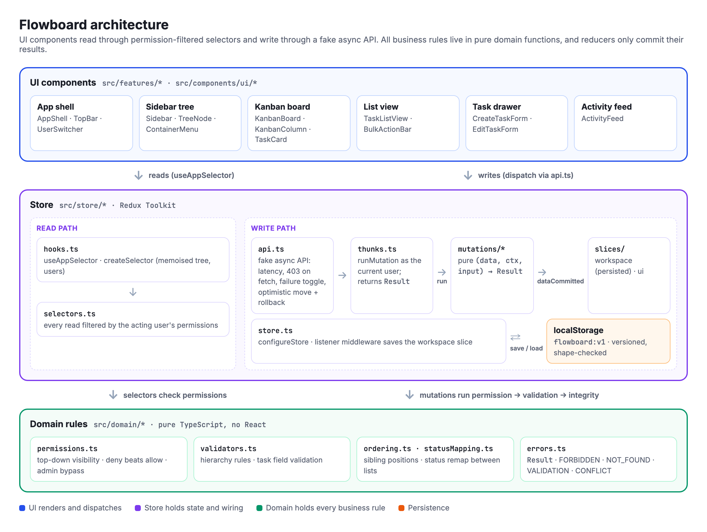

# Flowboard

[](https://flowboard.sunidhijain2002.workers.dev/)

A small project-management app: Workspace → Space → (Folder) → List → Tasks, with a Kanban board, a list view and per-user permissions. There's no backend. A typed client store with seed data stands in for the API.

Built with React 18, TypeScript, Vite, Tailwind CSS, Redux Toolkit, dnd-kit and Headless UI. Tested with Vitest, Testing Library and Playwright.

## How to run locally

You need Node.js 22.22.2 or newer (or 24.15+ / 26+), npm and Git.

```bash
git clone https://github.com/sunidhij/flowboard.git
cd flowboard
npm install
npm run dev        # http://localhost:5173
```

Other scripts:

- `npm run build`: type-check and build for production
- `npm run lint`: ESLint
- `npm test`: unit and component tests
- `npm run test:e2e`: end-to-end tests (run `npx playwright install chromium` once first)

Use the user menu in the top right to switch between Alice (admin), Bob and Carol (members). "Reset demo data" in the same menu restores the seed.

## Architecture



There are three layers. React components show the UI. A Redux Toolkit store holds the state. Plain TypeScript functions hold all the business rules.

Components read data through selectors that only return what the current user is allowed to see. Writes go through a fake async API (`store/api.ts`) that runs a pure mutation: check permissions, validate, then save. If any step fails, nothing changes and the UI gets an error. The workspace is saved to localStorage, so changes survive a reload.

## Data model

Data is stored as `Record<id, Entity>` maps (`src/domain/types.ts`).

| Entity | Fields |
|---|---|
| Container | id, name, type (workspace, space, folder, list), parentId, position, visibility (public, private), archivedAt |
| Status | id, listId, name, category (todo, in_progress, done), color, position |
| Task | id, title, description, statusId, priority, assigneeIds, dueDate, position, primaryListId, parentTaskId, createdAt, updatedAt, archivedAt |
| User | id, name, role (admin, member), avatarColor |
| Grant | id, resourceId, userId, mode (allow, deny) |
| Activity | id, actorId, verb, containerId, taskId, meta, at |

Seed data (`src/data/seed.ts`):

```
Acme Inc.
├─ Engineering (public)
│  └─ Q2 Launch
│     ├─ Backlog   (public)     Carol: deny
│     └─ Sprint 12 (private)    Bob: allow
└─ Marketing (private)          Carol: allow
   └─ Campaigns
      └─ Social
```

Rules the store enforces:

- A space goes in the workspace, a folder goes in a space, and a list goes in a space or a folder.
- A task needs a title (up to 500 characters) and a status from its own list. Priority, assignees and due date are validated too.
- When a task moves to another list, its status changes to one with the same category there, and its subtasks move with it.
- Every list keeps at least one status in each category.
- Deleting is a soft delete: the item gets an `archivedAt` date instead of being removed. This makes Undo simple and no data is lost.

## How permissions are enforced

- Admins can see and edit everything.
- A member can see an item if they can see its parent, it isn't denied to them, and it's either public or allowed to them. A deny always wins over an allow.
- Members can create, edit, move and delete tasks in lists they can see. Only admins can manage spaces, folders, lists and statuses.

These checks run in the store, not just in the UI. Selectors filter every read by the current user. Every mutation checks permissions first and returns a `FORBIDDEN` error if the check fails. Opening a list you can't see by URL shows "Access denied". Switching to a user who can't see the open list takes them to a list they can see.

To extend this, I'd add teams (grants for a team as well as a user) and per-item roles like viewer, editor and owner.

## Important technical decisions

- Business rules live in plain functions outside React and Redux, so they're easy to unit-test.
- Every store action returns the same result shape: `{ ok: true, data }` or `{ ok: false, error }`.
- A fake async API adds latency and can simulate failures, so loading, error and rollback states are real.
- Lists have their own URL (`/lists/:listId`). Access is checked again on every load.
- Saved data is checked when it loads. If it's invalid, the app falls back to the seed.
- Error messages are written for users, and error boundaries stop one broken view from crashing the whole app.

## Assumptions and deviations

- Folders are optional. A list can sit directly in a space.
- Only admins manage containers and statuses, because the brief only says members "can edit tasks".
- "Access denied" appears when a hidden list is opened by URL. Switching users redirects instead.
- A status's category can't be changed, so a list can't lose its last status in a category by accident.
- Reordering works within the same parent only. Nothing can be moved to a new parent.

## Stretch goals attempted

1. **Optimistic drag and drop with rollback.** A moved card updates right away. If saving fails, it goes back and an error appears. Turn on "Simulate failures" to try it.
2. **Activity feed.** Task and container changes are logged and shown per list and per task. The feed respects permissions.
3. **Deployed on Cloudflare** 
   Live URL: https://flowboard.sunidhijain2002.workers.dev/

## Trade-offs and week 2

What I cut:

- There's no screen for managing grants. They come from the seed.
- Spaces, folders and lists can be reordered but not moved to a new parent.
- Descriptions are plain text.

What I'd do in week 2:

1. Check that assignees can see the task's list. Today the store only checks that the user exists.
2. Hide task titles in the activity feed from people who can no longer see the task after it moved.
3. A screen for managing permissions.
4. Search and filters (assignee, priority, overdue).
5. Reordering status columns by dragging.
6. Virtualised long lists and paginated activity.

## AI usage log

Claude Code was used as a development assistant for implementation, testing, debugging and refactoring. I made the product and architecture decisions, reviewed every change, and verified the final implementation.

**The full log is in [AI_USAGE.md](./AI_USAGE.md).**
